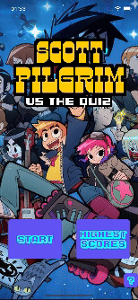
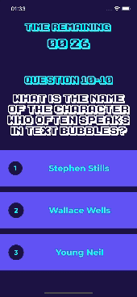
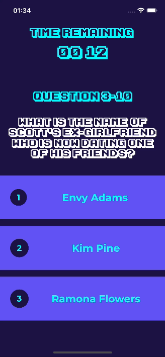

# Scott Pilgrim vs the Quiz
## 0. Abstract
Create a "Quiz app" against the clock with a ranking system.

## 1. Requirements

* The design is free to choose.  
* The theme of the quiz questions will be freely chosen. It might be a good idea to stick to a single theme (e.g., questions about the "Harry Potter" universe).  
* On the home screen, you can start playing or check the score ranking.  
* The game will consist of 10 random questions with 3 answers, and only one is correct. It is recommended to create more than 10 questions so that the same ones don't always appear. Each time a question is answered, the game will move on to the next one.  
* There are 30 seconds available to answer each question. The timer should appear on the screen, and if it reaches 0, the question will be considered incorrect.
* Upon selecting an answer or when time runs out, the game will indicate whether the question was answered correctly or not, providing feedback on the correct answer.
* Scoring system:
  * Timer reaches 0 or incorrect answer = 0 points.  
  * Timer greater than 0 and correct answer = [remaining seconds] points.  
    For example: If there are 9 seconds left when answering correctly, 9 points are awarded.  
* Once question number 10 is completed, a new screen will display the final score, and a name must be entered to save it persistently (even if the app is closed). After this, the ranking screen will appear.  
* The ranking screen shows the top 10 results, sorted from highest to lowest, along with the saved names. From this screen, it should always be possible to navigate back to the home screen.  

## 2. Screenshots
   

   

## 3. Demo
  

## 4. Assets sources
* _Dusty_ font from [DaFont.com](https://dafont.com/dusty.font)
* _Karmatic Arcade_ font from [DaFont.com](https://www.dafont.com/karmatic-arcade.font)
* _Montserrat_ font from [Google Fonts](https://fonts.google.com/specimen/Montserrat)
* _Superfly_ font from [DaFont.com](https://www.dafont.com/superfly.font)

**Disclaimer:** _"Scott Pilgrim" and all related characters, settings, and trademarks are the property of Bryan Lee O'Malley and their respective rights holders. This project is a fan-made application created for educational and non-commercial purposes. No copyright infringement is intended._

## 5. Problem source
 by [Brais Moure (MoureDev)](https://mouredev.com/).

## 6. Contact me

